CUDA Rasterizer
===============

[CLICK ME FOR INSTRUCTION OF THIS PROJECT](./INSTRUCTION.md)

**University of Pennsylvania, CIS 565: GPU Programming and Architecture, Project 4**

* Rudraksha Shah
* Tested on: Windows 10, i7-7700HQ @ 2.80GHz 16GB, GTX 1050 4096MB (Personal Computer)

// Turn Table Gif...

## Points and Lines Rasterization Renders

| Points | Lines |
| --- | ---  |
| 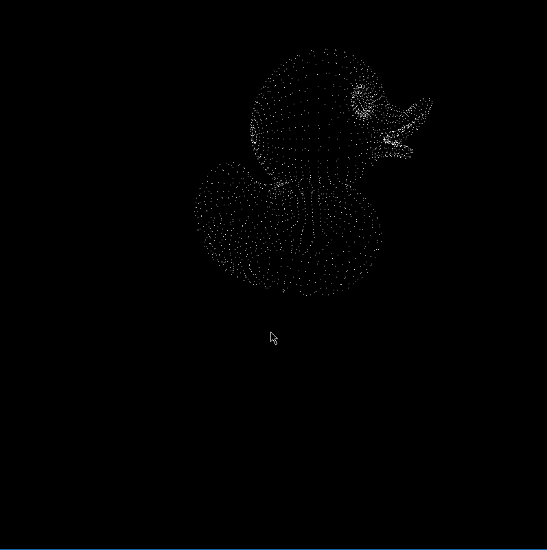 | 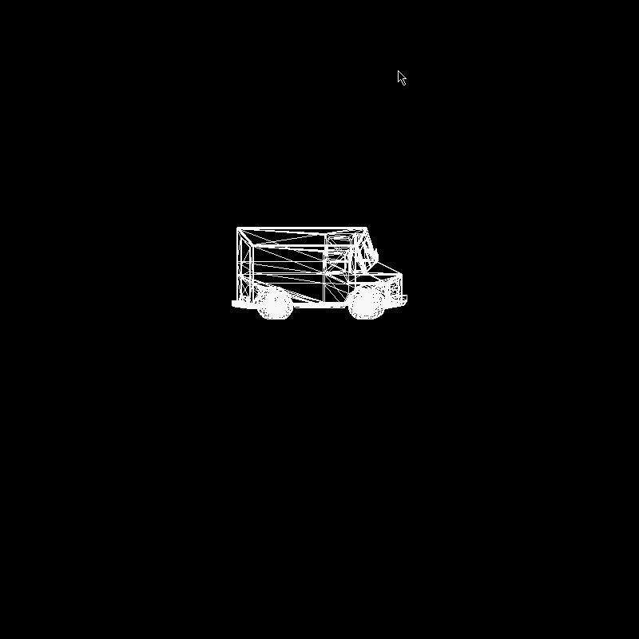 | 

Texturing | Bi-Linear Filtering
--- | ---
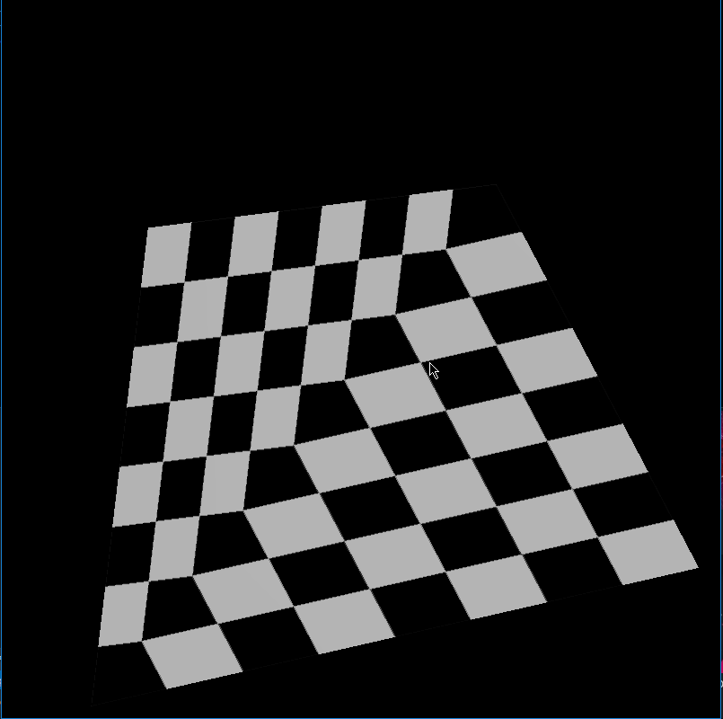 | 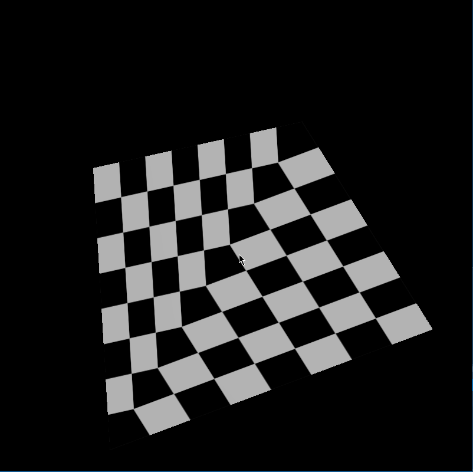

Texturinng | Texture - Perpective Correct Interpolation
--- | ---
 | 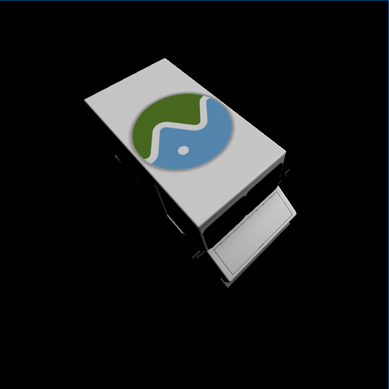
Overview
===========

In this project I have built a GPU Rasterizer using CUDA and C++.

The main features of the Rasterizer are as follows:

* Rasterization Methods:

    * Naive Barycentric Rasterization
    * Scan-Line Rasterization

* Rasterization Modes:

    * Points
    * Lines
    * Triangles    

* Texturing:

    * Perspective Correct Interpolation
    * Bi-Linear Filtering

* Shading:

    * Lambert

* Anti-Aliasing:

    * FXAA
    * SSAA

* Optimizations:

    * Back Face Culling

Rasterization is a way of rendering 3D graphics in which we project the geometry of the scene onto the screen.

Implementing the Rasterization on the CPU a year ago in CIS 460 was tricky but implementing the entire pipeline on the GPU was a challange in itself!

The basic process of Rasterization is to take 3d geometry in object space then take it from object space -> world space -> camera space -> un-homogenized projected space -> homogenized NDC space -> pixel space. Once the object is in 2D pixel space it is rendered onto the screen. For rendering I have implemented the following methods:

1. Barycentric Rasterization: In this method we iterate through each pizel in the bounding box surrounding the given triangle we are trying to render and check for each pixel if it lies inside the triangle or not using barycetric weights.

2. Scan-Line Rasterization: In this method we again start from the bounding box surrounding the triangle we are renderig but for each pixel row we find valid intersections with the triangle edges. Now we fill in those pixels from one point of intersection to the other. This way we do not have to spend time checking unnecessary pixels around the triangle.

Performance Analysis
=======================

* All performance analysis is done using the Cesium Milk Truck gltf model and the Barycentric Rasterization process of rendering with solid color per vertex and lambert shading.

## No Anti Aliasing vs FXAA vs SSAA

 No Anti Aliasing | FXAA | SSAA 
 --- | --- | ---
 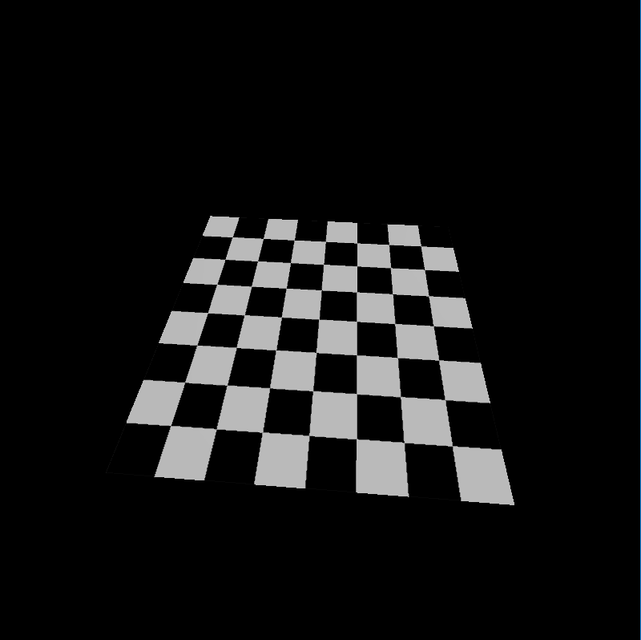 | 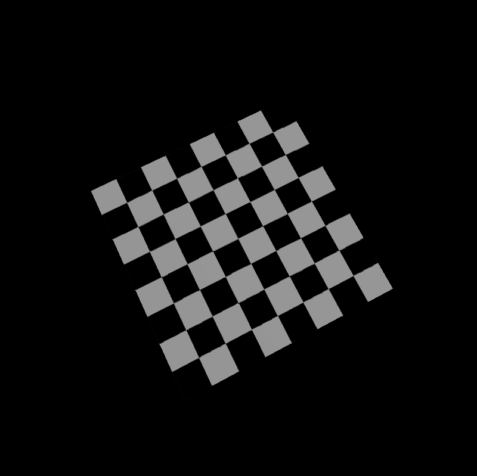 | 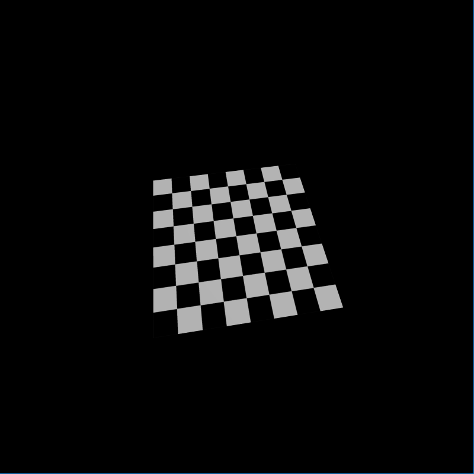

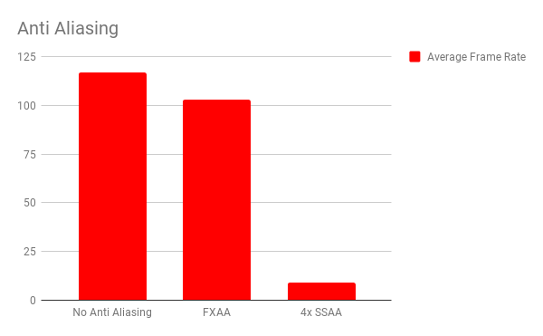

* FXAA: It stands for Fast Approximate Anti Aliasing. It is a post process anti aliasing method that works by finding the edges in the final rendered image and then smoothening them.

    It is a hack way of doing anti aliasing but it is one the fastest and with little to no overhead cost of implementation. The only downside is that it does not understand goemtry so it might end up anti aliasing some parts of the image that do not need to be smoothed. But the performance vs final result tradeoff is very good and comparable to a 4x SSAA. 

* SSAA: It stands for Super Sampling anti Aliasing. As its name suggest we do just that. First we go through the entire rasterization pipeline with the resolution set to a Factor of SSAA which are 2x, 4x, 8x and so on. Then finaly when we are plotting the pixels to the screen we take the scaled up texture and sample it to fill the final image with the original reslution.
    
    This was we create a sharp image from the begining and down sampling in the end gains us the extra level of detail needed to do anti aliasing.

* As expected and we can confirm this from the chart that as compared to the standard SSAA anti aliasing the FXAA anti aliasing method is considerably faster and only costs us about 5-10% performance drop. While the SSAA anti aliasing method costs us a whopping 80-90% performance drop. This to me is wired as I expected SSAA to have a performace hit on the frame rate by 50% but not by this much.
    
    The original size of the image was 800 x 800 and the SSAA size was 3200 x 3200 4x times. One explanation I have for the drastic drop in the frame rate might be the overhead cost of having many more threads doing nothing. As the image of the truck as is was very small and thus only a small portion of the image contained the object. But spawnnig so many threads and their overhead of minimal computation along with the sparceness of the image content might have added up to reduce the frame rate.

## No Back Face Culling vs Back Face Culling

No Back Face Culling | With Back Face Culling Turned On
--- | ---
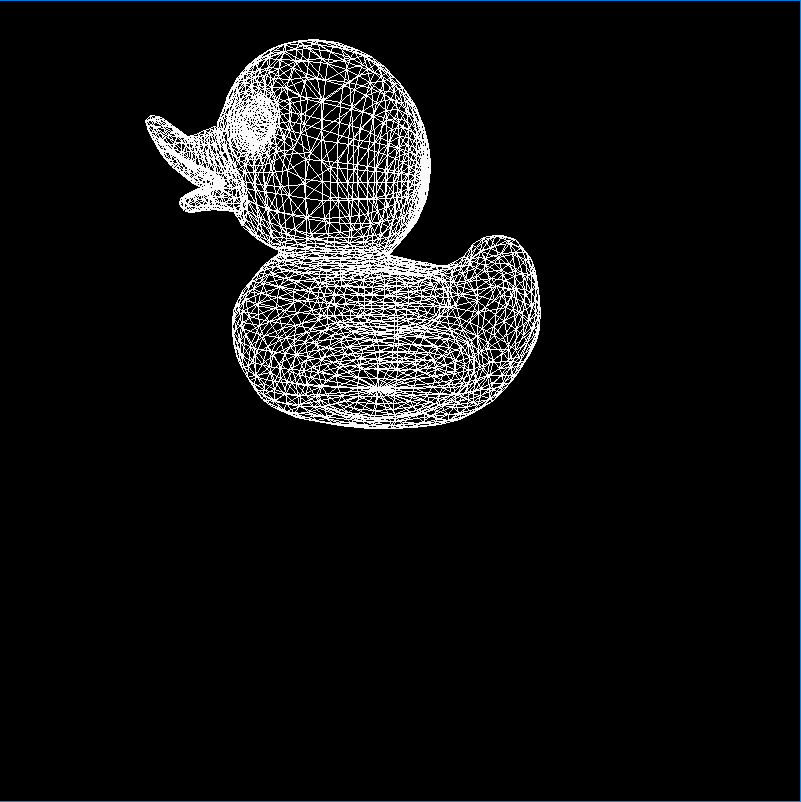 | 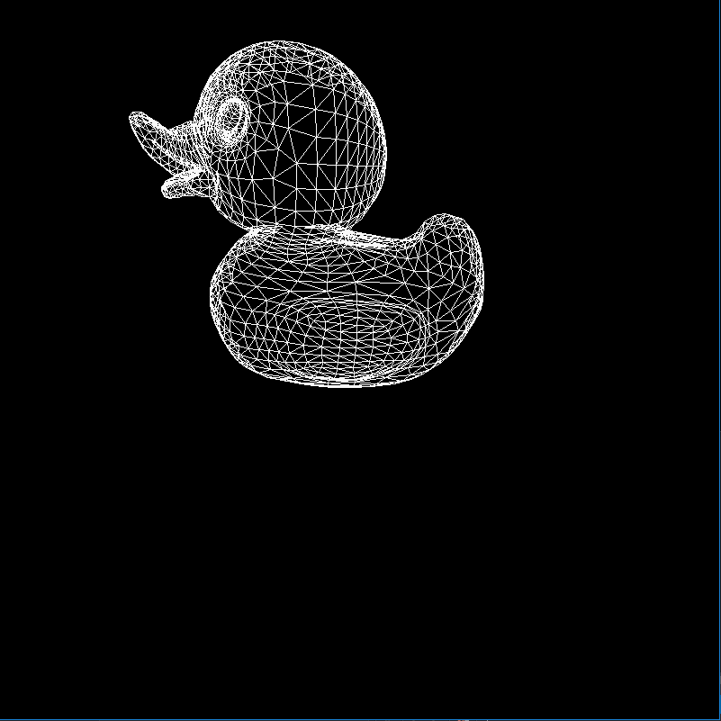

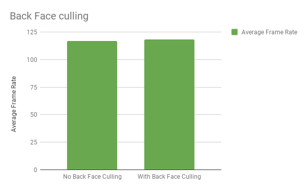

* In this case I expected there to be a minimum of 5% of performance improvement but the frame rate did not change which leads me to believe that just returning the threads that have been deemed to be checking a culled triangle is not enough to gain a performance gain.

    On the conterary the mesh that we were working with needed be sufficiently large and complex to warrent a compaction. As from past experience `thrust` compaction has a significant overhead that is not at all feasible for such small workloads.    

## Rasterization Methods

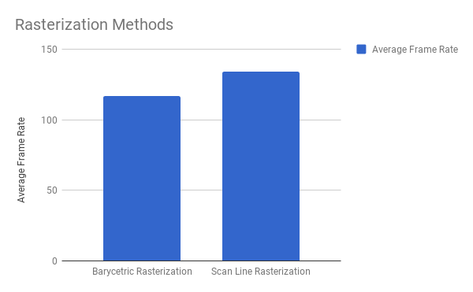

* In this case I am a bit surprised and also happy that my expectataion had been met. While implementing the rasterizer on the CPU I had learned that calculating and checking the barycentric coordinates for all the points inside the bounding box is not a feasible or efficient way of doing rasterization of complex geometries on the CPU.

    Translating that understanding I thought that it would be a performance optimization to have the pipeline follow the scan line implementation even on the GPU. And lo and behold it is!

    My rational behind this optimization is that it is far more efficient to do two calculations for intersetions per pixel row inside the bounding box of the triangle and filling in the pixels between those intersection points. Than to check each and every pixel against the traingle essentially doing NxN computations for each pixel in the bounding box of dimension NxN.

Bloopers:
==========

* In this image it looks like I am applying shadows to edges giving them a depth... which would be a cool thing to do! but unfortunatley its just me incorrectly assuming the texture coordinates while detecting the edge in FXAA.

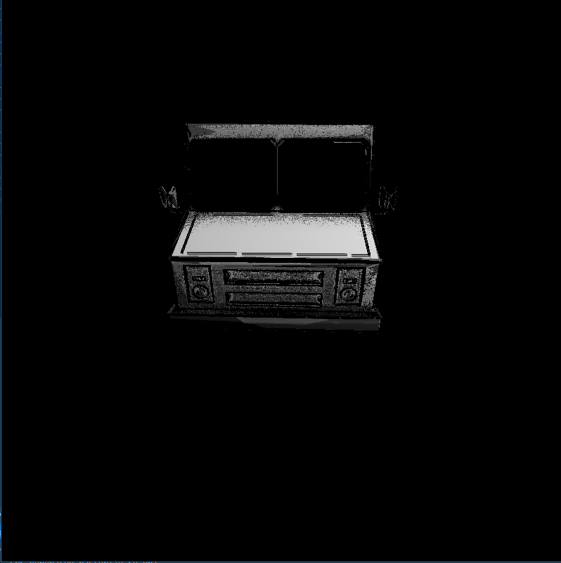

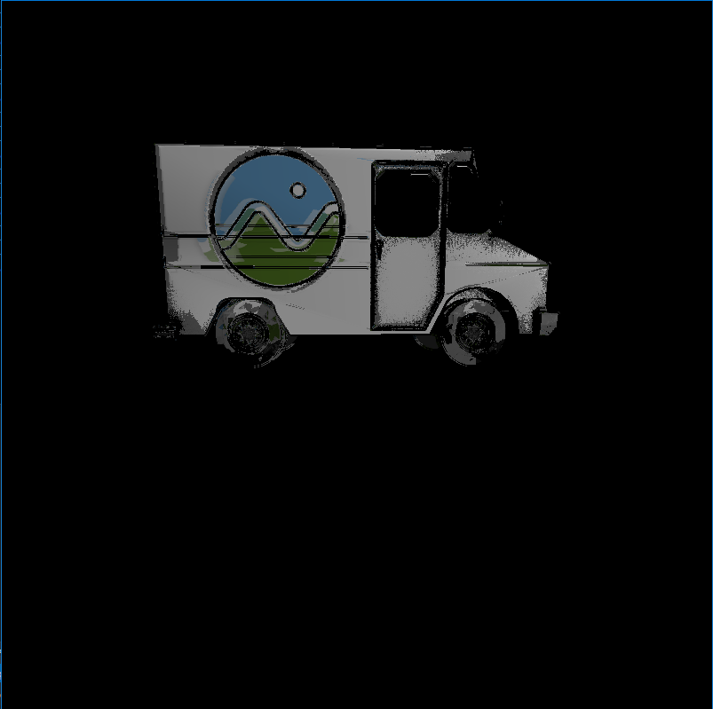

### Credits

* [Bresenham's Algo](https://www.cs.helsinki.fi/group/goa/mallinnus/lines/bresenh.html)
* [FXAA information](https://blog.codinghorror.com/fast-approximate-anti-aliasing-fxaa/)
* [FXAA original paper](http://developer.download.nvidia.com/assets/gamedev/files/sdk/11/FXAA_WhitePaper.pdf)
* [FXAA tutorial](http://blog.simonrodriguez.fr/articles/30-07-2016_implementing_fxaa.html)
* [tinygltfloader](https://github.com/syoyo/tinygltfloader) by [@soyoyo](https://github.com/syoyo)
* [glTF Sample Models](https://github.com/KhronosGroup/glTF/blob/master/sampleModels/README.md)
